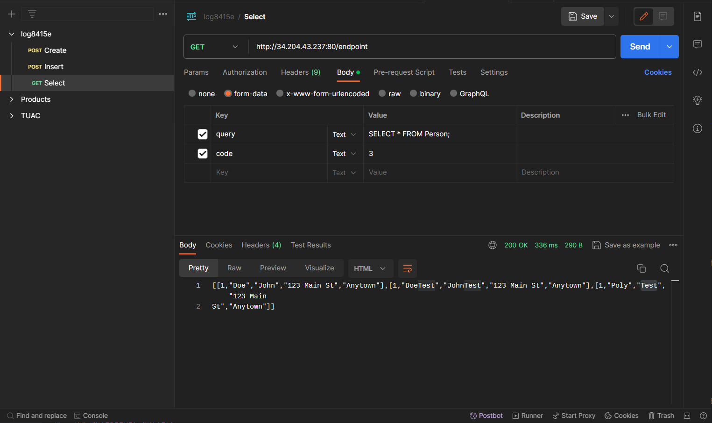

# LOG8415e : Final project
[Part 1] Demo of my results : https://youtu.be/JhSiSl5i_OE

[Part 2] Code explanation : https://youtu.be/jepVk-Tn0rk
## Terraform
In order to lunch the infrastructure with all the instances, you need to run ```terraform apply``` inside the **log8415e/sql** folder.

## MySQL
Inside all the next instances, after connecting via ssh, you will need to clone the repository before doing the rest of the commands :
1. git clone https://github.com/tuanquocpham123456/log8415e.git
2. cd log8415e/sql

### MySQL Standalone
1. bash standalone.sh

It will install Sakila, populate the database structure and run the Sysbench benchmark.
### MySQL Manager
1. bash manager.sh
2. bash manager_sysbench.sh

The first command will setup the MySQL cluster manager.
The second command will install Sakila, populate the database structure and run the Sysbench benchmark.

After creating the proxy instance, run these commands in order to create a user associated with the proxy instance:
1. sudo mysql
2. mysql> CREATE USER 'ubuntu'@'proxy_public_ip_adress' IDENTIFIED BY 'admin';
3. mysql> GRANT ALL PRIVILEGES ON *.* TO 'ubuntu'@'proxy_public_ip_adress' WITH GRANT OPTION;
4. mysql> FLUSH PRIVILEGES;
4. mysql> exit

### On all the MySQL workers
1. bash worker.sh

This will set up each worker and connect it to the MySQL cluster manager.

## Gatekeeper pattern
In order to run the gatekeeper pattern, you need to run the following commands inside the gatekeeper instance after connecting via ssh:
1. git clone https://github.com/tuanquocpham123456/log8415e.git
2. cd log8415e/cloudpatterns
3. bash init.sh
4. bash gatekeeper.sh

## Proxy pattern
In order to run the proxy pattern, you need to run the following commands inside the proxy instance after connecting via ssh:
1. git clone https://github.com/tuanquocpham123456/log8415e.git
2. cd log8415e/cloudpatterns
3. bash init.sh
4. bash proxy.sh

## SQL queries
Open the Postman app in order to run the SQL queries as a body of a POST or GET request with the gatekeeper public ip adress.
Don't forget to add a code inside a form-data which represents :
- 1 for a direct hit
- 2 for random
- 3 for customized

Here is an example of a POST request with the body of the query:
